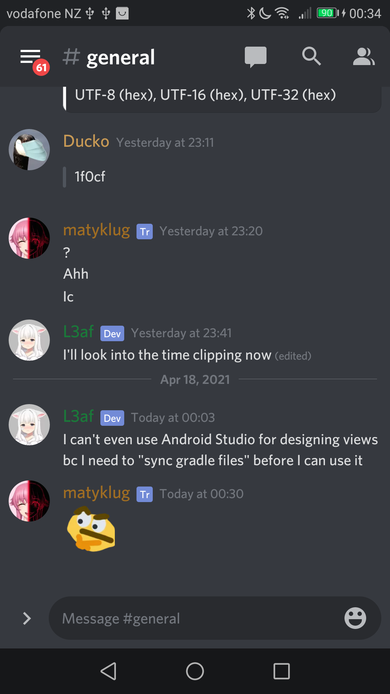
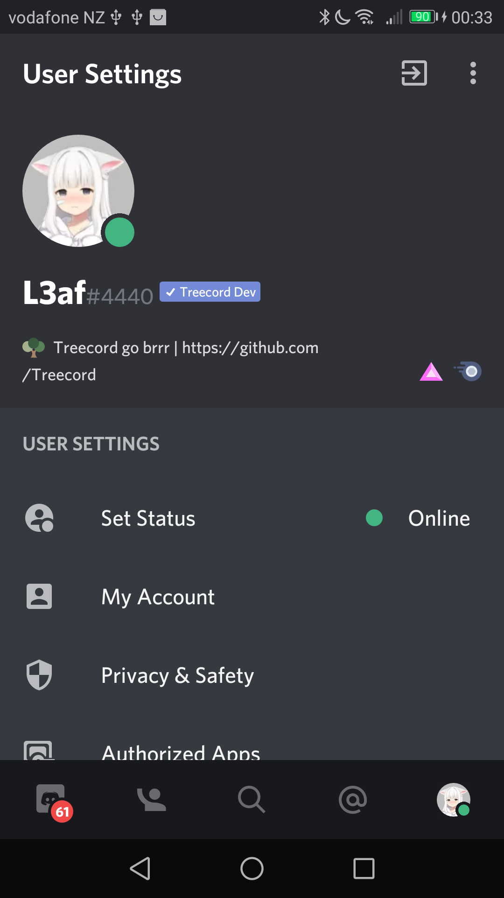
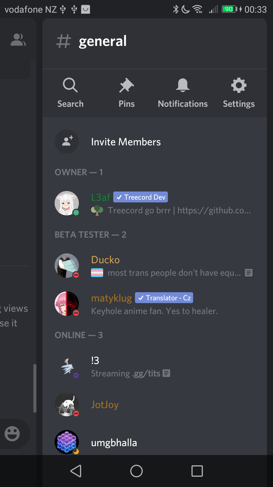
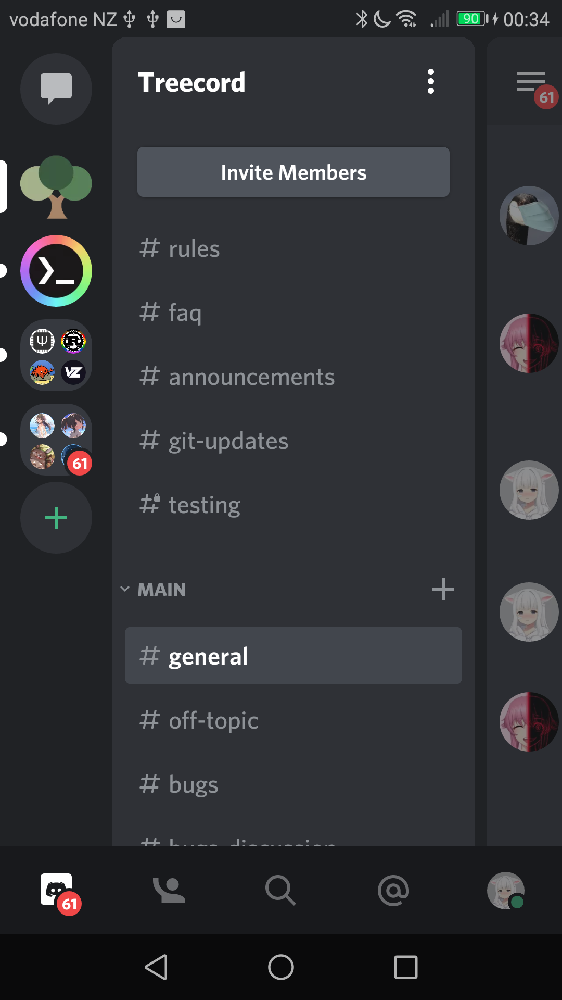

    <!-- Optionally recolor Treecord icon, must be hosted on Treecord GitHub repository or Imgur -->
    

<h1 align="center">Treecord - {Theme name}</h1>

{Short theme description}

    

        <h3 align="center">Chat</h3>
        

            
        

    

    

        <h3 align="center">Settings</h3>
        

            
        

    

    

        <h3 align="center">Member List</h3>
        

            
        

    

    

        <h3 align="center">Guild/Channel List</h3>
        

            
        

    

